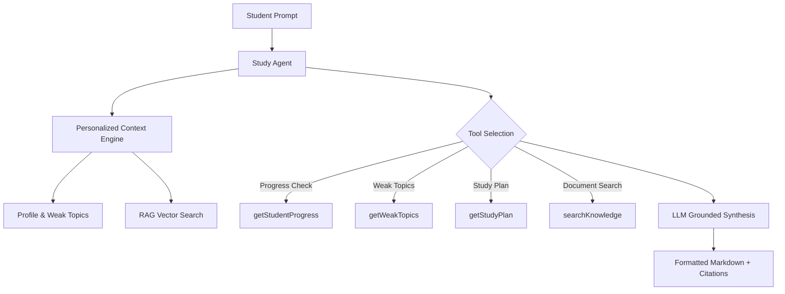

# AI Agent Architecture

The **Central Study Agent** (`lib/ai/agent.ts`) acts as the orchestrator for the entire platform.

## Available Agent Tools
- `searchKnowledge`: Hybrid RAG document retrieval.
- `getStudentProgress`: Returns study time, streak, and accuracy metrics.
- `getWeakTopics`: Fetches topics with mastery <65%.
- `getStrongTopics`: Fetches topics with mastery >=75%.
- `getStudyPlan`: Retrieves scheduled daily study tasks.
- `generateQuiz`: Creates adaptive quizzes.
- `recordStudySession`: Logs study minutes.
- `webSearch`: Standard web information reference.
