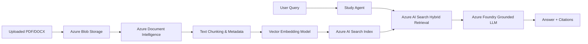

# RAG Architecture & Multi-Tenant Isolation

## RAG Ingestion & Query Pipeline

## Multi-Tenant Security Rules
Every vector search query sent to Azure AI Search or the local Mock Search Provider applies an explicit OData filter:
\`\`\`odata
userId eq 'user-demo-123'
\`\`\`
This prevents cross-user document retrieval leakage.
